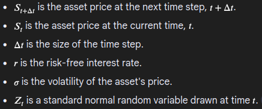
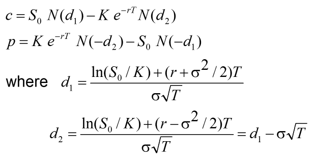

# Parallelized Option Pricing Simulator

## Summary

This project implements a Monte Carlo simulation engine in C++ using OpenMP to price options. In this project, we use the Black-Scholes model as a framework to describe how asset prices behave over time. It provides the mathematical assumptions we rely on, such as constant volatility, no arbitrage, and asset prices following a geometric Brownian motion.

We then apply a Monte Carlo simulation engine to estimate the future price of the asset based on these assumptions:
- The Black-Scholes framework gives us a formula that models how the asset price evolves step-by-step, including a random variable Z that represents unpredictable market movements.
- The Monte Carlo engine simulates many possible price paths by generating different values for Z at each step.
- Each simulation gives us one possible future path for the asset price.
- We repeat this simulation many times (thousands or more), producing a wide range of potential futures.

By averaging the option payoff across all of these paths, we estimate the expected value of the option today.

## Technologies

- C++
- OpenMP
- Python (for visualization)
- Makefile

## Background

### What are options?

Options are financial contracts that give the buyer the right, but not the obligation, to buy or sell an underlying asset at a fixed price (called the strike price) before or at a specific expiration date.

There are two main types of option contracts:

#### Call Option
Gives the buyer the right to buy the asset at the strike price.
- You buy a call when you believe the asset's price will go up.
- **Example**: Suppose you expect the price of a product (like a stock) to rise soon. You buy a call option, paying a premium to lock in the ability to buy it at today's price.
- If the price rises above the strike, you can either exercise the option to buy low and sell high or sell the option itself for a profit.
- If the price doesn't rise, you simply let the option expire. Your only loss is the premium you paid.

#### Put Option
Gives the buyer the right to sell the asset at the strike price.
- You buy a put when you want to protect yourself from falling prices.
- **Example**: Imagine you're a seller of apples and fear the market price will fall. You buy a put option to secure the right to sell your apples at a fixed price.
- If prices drop, you can still sell at the higher strike price, thus limiting your losses.
- If prices rise, you let the put expire and just lose the premium, but you still benefit from the higher market prices.

As you can see, options are commonly used for speculation or risk management. Unlike owning the asset directly, options let traders bet on price movements while limiting their downside. 

**Note:**
- In order to buy an option, you must pay a premium to the seller.
- Options have expiration dates.

### What is the Black-Scholes Model?

The Black-Scholes Model is a mathematical formula used to calculate option values. In reality, stock prices are chaotic and are influenced by news, emotions, earnings, wars, etc. The model allows us to simulate this mathematically by assuming that the option prices follow **geometric Brownian motion**: random evolution with constant drift and volatility.

#### How does this project use Monte Carlo?

While Black-Scholes provides closed-form solutions for simple European options, it has significant limitations, such as unrealistic assumptions (constant volatility, no dividends, no transaction costs).

Our Monte Carlo approach uses the **same mathematical foundation** (geometric Brownian motion) but **simulates** the process instead of using analytical formulas (simply plugging in values). This allows us to price complex derivatives that cannot be accurately estimated by the closed-form Black Scholes formula.

The discrete step formula we use:

For each path, we simulate the price step by step using this formula and then we average thousands of paths to estimate option values.

### Putting it all together

Our Monte Carlo simulation engine helps us estimate the value of options by simulating many possible future price scenarios for the underlying asset.

Here's how it works:

1. **Start with today's asset price.**

2. **Use the Black-Scholes assumptions** to model how the price might change over small time steps into the future. This includes factors like volatility (how much the price can fluctuate) and expected return.

3. **At each small time step**, we simulate how the price might change using this formula:

   

   

   Z represents the random shock to the asset price at that step. Most of the time, it's near 0 (small price changes), but sometimes it's larger, causing bigger fluctuations.

   **Note**: Real-world data shows that daily price changes (especially log returns) are often clustered around a mean (usually close to 0), with fewer large changes, which is the behavior of a normal bell curve.

4. **Repeat this step-by-step price update** many times to create one possible "path" of how the price might move over time (this is where the multithreading optimization comes in).

5. **Simulate thousands or millions of these paths.** Each one represents a different possible future for the asset price, capturing the uncertainty and randomness of the market.

6. **For each simulated path**, calculate the payoff of the option (how much it would be worth at expiration).
   - **For a call option**: payoff = max(final_asset_price - strike_price, 0)  
     (If the final asset price is above the strike price, you gain the difference; otherwise, zero.)
   
   - **For a put option**: payoff = max(strike_price - final_asset_price, 0)  
     (If the final asset price is below the strike price, you gain the difference; otherwise, zero.)

7. **Average all those payoffs together** to estimate the expected value of the option today.

## Evaluating the model

We will evaluate the Monte Carlo simulation engine in two key ways:

1. **Performance Comparison**: Measure the speedup achieved by parallelizing the simulation with OpenMP by comparing the run time of the single-threaded and multi-threaded versions.

2. **Accuracy Check**: Compare the option price estimated by our Monte Carlo simulation against the price calculated using the Black-Scholes closed-form analytical formula (when applicable) for both the call and put options. This helps validate the correctness of our simulation under ideal conditions.

The following is the Black Scholes closed form analytical formula for the call and put options:

Where:
- c = call option price
- p = put option price
- S = current asset price
- K = strike price
- r = risk-free interest rate (annual, continuous compounding)
- T = time to expiration (in years)
- σ = volatility of the asset's returns (standard deviation)
- N(x) = cumulative distribution function of the standard normal distribution (probability that a normal variable ≤ x)
  - **Note**: We use the erf (error function) to compute the CDF.
- e = base of natural logarithm (Euler's number)

## User Input

- **Current asset price (S₀)** → the price of the underlying asset today
- **Strike price (K)** → the price at which the option can be exercised
- **Time to expiration (T)** → usually in years (e.g., 0.5 for 6 months)
- **Volatility (σ)** → annualized standard deviation of the asset's returns (e.g., 0.2 for 20%)
- **Risk-free interest rate (r)** → annualized risk-free rate (e.g., 0.05 for 5%)
- **Number of simulation paths** → how many random price paths to generate (more paths → more accurate results but slower)
- **Number of time steps per path** → how many small intervals to split the total time T into (change in time - dt). When simulating a price path from today until option expiration, you break the total time period into small intervals, called time steps. Instead of jumping directly from the start price to the end price in one go, you simulate the price step-by-step, moving forward a little bit at a time. 

Note: The maximum allowed number of time steps per path is capped at 1,000 to balance simulation accuracy and performance because increasing beyond this yields diminishing returns.

## Running The Application

To run the application, you have 2 options:
  1. Create a virtual environment in the root directory, cd into src, run pip install requirements.txt, then run make
  2. Run pip install requirements.txt, cd into src, and run each command in the Makefile

Note: The Makefile only works on a bash shell.